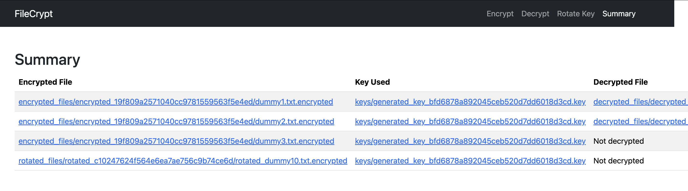

# FileCrypt

A Python-based tool for securely encrypting and decrypting files using Fernet symmetric encryption from the `cryptography` library. This project provides simple, secure, and efficient scripts for both encryption and decryption of files, with advanced features for flexibility and security. Additionally, a Flask-based User-Interface is provided for encryption, decryption, and key rotation functionalities.

## Features

- Encrypt and decrypt files of any type (text, images, etc.) with a secure key.
- Support for password-protected key derivation using PBKDF2HMAC.
- Encrypt/decrypt multiple files or entire directories.
- Overwrite protection to prevent accidental data loss.
- Verbose mode for detailed operation logging.
- Key rotation for updating encryption keys.
- Compression before encryption to reduce file size.
- Progress bar for large file operations.
- File integrity verification using SHA-256 hashes.
- Configuration file support for default settings.
- Backup option to preserve input files.
- Generates and manages encryption keys securely.
- Robust error handling for file and key operations.
- Flask API for programmatic encryption/decryption.

## Usage

The project includes two command-line scripts (`encrypt.py` and `decrypt.py`) and a Flask API (`app.py`) for programmatic access. The scripts and API are in the `file-crypt` directory.

### Encryption (`encrypt.py`)

Encrypt files or directories using a key file or a password-derived key. Supports multiple files, compression, key rotation, and more.

**Command-Line Flags**:
- `-i/--input`: Input file(s) or directory to encrypt (required, supports multiple paths).
- `-o/--output`: Output file or directory for encrypted data (required).
- `-k/--key`: Key file to store/load the encryption key (required unless `--password` is used).
- `--password`: Password to derive the encryption key (ignores `--key` if provided).
- `--rotate-key`: Old key file for key rotation (requires `--new-key`, single file only).
- `--new-key`: New key file for key rotation.
- `--compress`: Compress files before encryption to reduce size.
- `--force`: Force overwrite of existing output files without prompting.
- `--backup`: Create a backup of input files (`.bak` extension).
- `--verbose`: Enable detailed output for operations.
- `--config`: Path to an INI configuration file for default settings.
- `-h/--help`: Show the help message and exit.

**Examples**:

1. **Encrypt a Single File with a Key File**:
   ```bash
   python encrypt.py -i example.txt -o example.txt.encrypted -k secret.key --verbose
   ```
   Generates or loads `secret.key`, encrypts `example.txt`, and saves the result to `example.txt.encrypted`.

2. **Encrypt a File with a Password**:
   ```bash
   python encrypt.py -i example.txt -o example.txt.encrypted --password mysecurepassword --compress
   ```
   Derives a key from the password, compresses the file, and encrypts it. Creates `salt.bin` for key derivation.

3. **Encrypt Multiple Files**:
   ```bash
   python encrypt.py -i file1.txt file2.txt -o output_dir -k secret.key --backup
   ```
   Encrypts `file1.txt` and `file2.txt`, saves results to `output_dir/file1.txt.encrypted` and `output_dir/file2.txt.encrypted`, and creates backups.

4. **Encrypt a Directory**:
   ```bash
   python encrypt.py -i input_dir -o output_dir -k secret.key --force --verbose
   ```
   Encrypts all files in `input_dir`, preserving directory structure in `output_dir`.

5. **Key Rotation**:
   ```bash
   python encrypt.py -i old.encrypted -o new.encrypted --rotate-key old_key.key --new-key new_key.key
   ```
   Decrypts `old.encrypted` with `old_key.key` and re-encrypts it with `new_key.key`.

6. **Using a Configuration File**:
   Create `config.ini`:
   ```ini
   [DEFAULT]
   input = example.txt
   output = output_dir
   key = secret.key
   compress = True
   backup = True
   verbose = True
   ```
   Run:
   ```bash
   python encrypt.py --config config.ini
   ```

7. **Show Help**:
   ```bash
   python encrypt.py -h
   ```

### Decryption (`decrypt.py`)

Decrypt files or directories using the same key or password used for encryption. Supports hash verification, decompression, and more.

**Command-Line Flags**:
- `-i/--input`: Input encrypted file(s) or directory (required, supports multiple paths).
- `-o/--output`: Output file or directory for decrypted data (required).
- `-k/--key`: Key file containing the encryption key (required unless `--password` is used).
- `--password`: Password to derive the encryption key (ignores `--key` if provided).
- `--verify-hash`: Verify file integrity using the stored SHA-256 hash.
- `--decompress`: Decompress files after decryption (required if encrypted with `--compress`).
- `--force`: Force overwrite of existing output files without prompting.
- `--backup`: Create a backup of input files (`.bak` extension).
- `--verbose`: Enable detailed output for operations.
- `--config`: Path to an INI configuration file for default settings.
- `-h/--help`: Show the help message and exit.

**Examples**:

1. **Decrypt a Single File with a Key File**:
   ```bash
   python decrypt.py -i example.txt.encrypted -o decrypted.txt -k secret.key --verbose
   ```
   Loads `secret.key`, decrypts `example.txt.encrypted`, and saves the result to `decrypted.txt`.

2. **Decrypt a File with a Password**:
   ```bash
   python decrypt.py -i example.txt.encrypted -o decrypted.txt --password mysecurepassword --decompress --verify-hash
   ```
   Derives the key from the password, decompresses, verifies the hash, and decrypts the file. Requires `salt.bin`.

3. **Decrypt Multiple Files**:
   ```bash
   python decrypt.py -i file1.txt.encrypted file2.txt.encrypted -o output_dir -k secret.key --backup
   ```
   Decrypts `file1.txt.encrypted` and `file2.txt.encrypted`, saves results to `output_dir/file1.txt` and `output_dir/file2.txt`, and creates backups.

4. **Decrypt a Directory**:
   ```bash
   python decrypt.py -i output_dir -o decrypted_dir -k secret.key --force --verbose
   ```
   Decrypts all `.encrypted` files in `output_dir`, preserving directory structure in `decrypted_dir`.

5. **Using a Configuration File**:
   Create `config.ini`:
   ```ini
   [DEFAULT]
   input = example.txt.encrypted
   output = decrypted_dir
   key = secret.key
   decompress = True
   verify_hash = True
   backup = True
   verbose = True
   ```
   Run:
   ```bash
   python decrypt.py --config config.ini
   ```

6. **Show Help**:
   ```bash
   python decrypt.py -h
   ```

### Flask API Usage (`app.py`)

The `app.py` script provides a RESTful API for encryption, decryption, and key rotation, built on Flask and using the `crypto_tools` module. It resides in the `file-crypt` directory and requires the `crypto_tools` module to be installed as a package.

#### How to Use the Flask App

### Install Dependencies

- python -m venv myvenv
- source myven/bin/activate
- pip install -r requirements.txt

### Run Flask App

- python app.py

**Screenshots**

### Encrypt Files


### Decrypt Files


### Rotate Keys


### Summary




#### Endpoints

1. **POST /encrypt**
   - **Form Data**:
     - `file`: The file to encrypt (required).
     - `password`: Password for key derivation (optional).
     - `key_file`: Key file for encryption (optional).
     - `compress`: Boolean (`true`/`false`) to compress before encryption (default: `false`).
     - `force`: Boolean to overwrite existing files (default: `false`).
     - `backup`: Boolean to create backups (default: `false`).
     - `verbose`: Boolean for verbose output (default: `false`).
   - **Response**: Encrypted file (`.encrypted`) with hash file generated.
   - **Example** (using `curl`):
     ```bash
     curl -X POST -F "file=@input.txt" -F "password=secret123" -F "compress=true" http://localhost:5000/encrypt -o output.encrypted
     ```

2. **POST /decrypt**
   - **Form Data**:
     - `file`: The encrypted file (required).
     - `password`: Password for key derivation (optional).
     - `key_file`: Key file for decryption (optional).
     - `verify_hash`: Boolean to verify hash (default: `false`).
     - `decompress`: Boolean to decompress after decryption (default: `false`).
     - `force`: Boolean to overwrite existing files (default: `false`).
     - `backup`: Boolean to create backups (default: `false`).
     - `verbose`: Boolean for verbose output (default: `false`).
   - **Response**: Decrypted file.
   - **Example**:
     ```bash
     curl -X POST -F "file=@output.encrypted" -F "password=secret123" -F "decompress=true" http://localhost:5000/decrypt -o decrypted.txt
     ```

3. **POST /rotate_key**
   - **Form Data**:
     - `file`: The encrypted file (required).
     - `old_key_file`: The old key file (required).
     - `new_key_file`: The new key file (optional; generates new key if not provided).
     - `compress`: Boolean to compress during re-encryption (default: `false`).
     - `force`: Boolean to overwrite existing files (default: `false`).
     - `backup`: Boolean to create backups (default: `false`).
     - `verbose`: Boolean for verbose output (default: `false`).
   - **Response**: File re-encrypted with the new key.
   - **Example**:
     ```bash
     curl -X POST -F "file=@output.encrypted" -F "old_key_file=@secret.key" -F "new_key_file=@new_secret.key" http://localhost:5000/rotate_key -o rotated.encrypted
     ```

## Notes

- **Key Compatibility**: Use the same key file or password (with `salt.bin`) for encryption and decryption.
- **Compression**: If a file was encrypted with `--compress`, use `--decompress` during decryption.
- **Hash Verification**: Requires the `.hash` file generated during encryption. Use `--verify-hash` to enable.
- **Configuration File**: Supported by CLI scripts; the Flask API does not currently use config files but can be extended.
- **Backups**: Created with `.bak` extension in the same directory as the input file.
- **Progress Bar**: Automatically displayed for large files in CLI using `tqdm`; not visible in API responses.
- **Directory Processing**: CLI preserves directory structure; API processes single files only.
- **API Deployment**: Ensure `crypto_tools` is installed for `app.py` to function.

**Credits**: Developed with Grok's assistance. Even Grok is not immune to getting stuck in a repetitive loop. For example, I kept asking it to produce a README in Markdown; however, it only provided part of it in a snippet and the rest as formatted markdown. I then had to paste the entire text and prompt it to generate the equivalent Markdown so that I could copy and paste the entire text from a single snippet.

